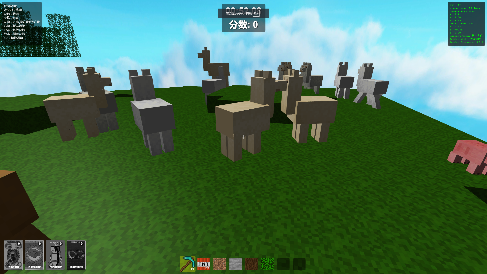

我的世界——爆炸的艺术
------------------

- by karminski-牙医



## 游戏介绍

公元2025年的某一天，天空中突然射下来了一束可疑的光线。你牧场中的动物开始疯狂繁殖。你不得不使用所有手段来阻止动物将你的农场挤爆。

## 本地启动游戏

```
python web-server.py --folder ./ --host 0.0.0.0 --port 9901
```

然后浏览器访问 ```http://127.0.0.1:9901/minecraft.html``` 即可


## 游戏升级可选项

- 军火商: 每增加一点, TNT 初始数量 + 1
- 核爆: 每增加一点, TNT 爆炸范围 + 1
- 羊驼奶: 每增加一点, 羊驼的生成最大数量 + 10
- 猪饲料: 每增加一点, 猪猪的生成最大数量 + 1
- 长者的眼镜: 每增加一点, 每局游戏最大时长 + 1s
- 奇怪的收购者: 每增加一点, 消灭一只动物的得分增加10%
- 幸运星: 每增加一点, 猪猪的道具掉落概率增加 2%
- 肌肉狂: 每增加一点, 人物的移动速度和跳跃高度增加 1%

## 猪猪掉落道具

- 砸瓦鲁多: 当前所有动物和时间停止10秒, 出现概率1%
- 磁力: 会用引力引周边10个格子内的动物, 持续5秒, 出现概率5%
- 凝固汽油弹: 爆炸波及的区域会燃烧, 持续5秒, 出现概率2%
- 无限: 放置炸弹不消耗炸弹数量, 持续5秒, 出现概率10% 

## bug list

- 卡片的碰撞高度检测貌似有问题，人物其实是3格子高的，没有碰撞到
- 摄像机万向节死锁问题还是有

## AI 编写有什么问题

- 过长后只能重构，当然重构AI可以部分帮忙
- 变量引用问题解决得非常不好，尤其是有上下文
- 代码写得垃圾，然后越来越屎山，比如一个方法需要好多参数，导致需要人工重构
- 需要视觉得问题也得自己动手，比如UV mapping，模型大小等


## License

- [MIT](./LICENSE)
